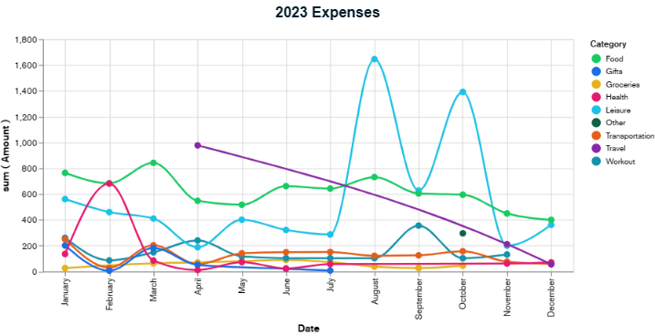

# Expenses Data Visualization 
A NodeJS App that processes exported CSV Files from a spending tracker that I personally use :  
[Money Manager](https://play.google.com/store/apps/details?id=ru.innim.my_finance)

With Data Visualization using [Atlas Charts](https://www.mongodb.com/docs/charts/#atlas-charts)

## Packages used
[XLSX](https://www.npmjs.com/package/xlsx)

[inquirer](https://www.npmjs.com/package/inquirer)

## Data Visualization using Atlas

## License

[MIT](https://choosealicense.com/licenses/mit/)
